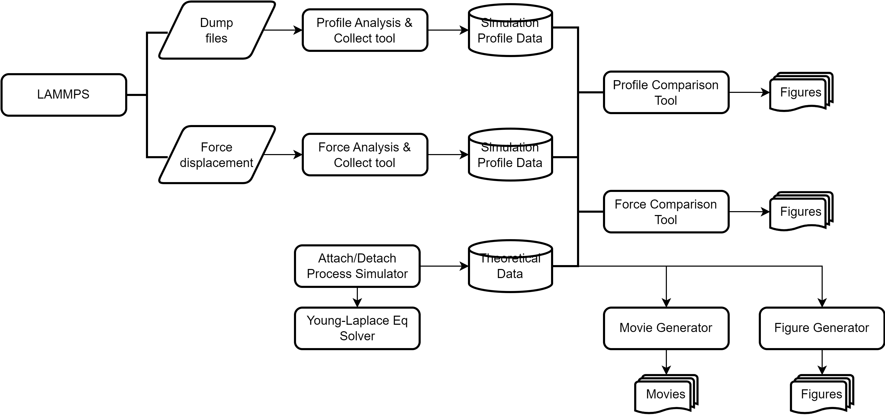

# Post-Analysis Tools for Pulling a Janus Particle

This is a code repo for paper. We use the python scripts to post-analyze the simulational results from LAMMPS and theoretical results from Young-Laplace theory. Enjoy!

### Analysis Routine

The following picture shows routine to use the python scripts in the project.

Use `pip install -r requirements.txt` to get `h5py` package.

