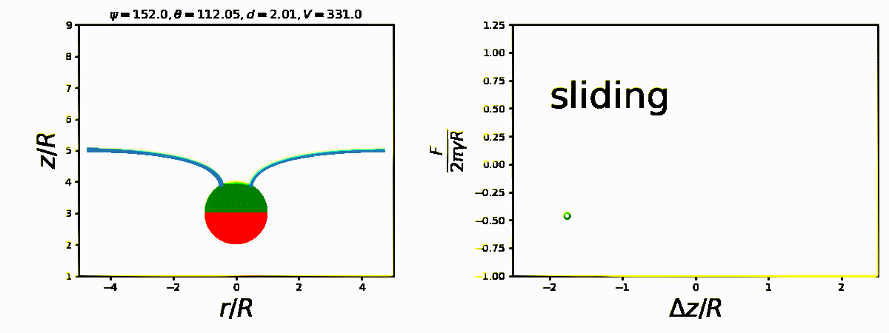

# Post-Analysis Tools for Pulling a Janus Particle

This is a code repo for paper. I use the following script structure to post-analyze the simulational results from LAMMPS and theoretical results from Young-Laplace theory. Enjoy!

